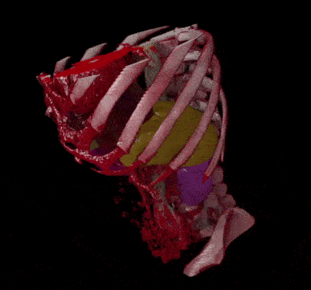

# Clara Viz

NVIDIA Clara Viz is a platform for visualization of 2D/3D medical imaging data. It enables building applications
that leverage powerful volumetric visualization using CUDA-based ray tracing. It also allows viewing of multi resolution
images used in digital pathology. 

<div style="display: flex; width: 100%; justify-content: center;">
  <div style="padding: 5px; height: 200px;">
    
  </div>
  <div style="padding: 5px; height: 200px;">
    
 </div>
</div>

Clara Viz offers a Python Wrapper for rapid experimentation. It also includes a collection of
visual widgets for performing interactive medical image visualization in Jupyter Lab notebooks.

## Known issues

On Windows, starting with Chrome version 91 (also with Microsoft Edge) the interactive Jupyter widget is not working correctly. There is a delay in the interactive view after starting interaction. This is an issue with the default (D3D11) rendering backend of the browser. To fix this open `chrome://flags/#use-angle` and switch the backend to `OpenGL`.

## Requirements

* NVIDIA GPU: Pascal or newer, including Pascal, Volta, Turing and Ampere families
* NVIDIA driver: 450.36.06+

## Documentation

https://docs.nvidia.com/clara-viz/index.html

## Quick Start

### Installation

This will install all Clara Viz packages use pip:

```bash
$ pip install clara-viz
```

Clara Viz is using namespace packages. The main functionality is implemented in the 'clara-viz-core' package,
Jupyter Notebook widgets are found in the 'clara-viz-widgets' package.
So for example if you just need the renderer use

```bash
$ pip install clara-viz-core
```

### Use interactive widget in Jupyter Notebook

Install the Jupyter notebook widgets.

```bash
$ pip install clara-viz-widgets
```

Start Jupyter Lab, open the notebooks in the `notebooks` folder. Make sure Git LFS is installed when cloning the repo, else the data files are not downloaded correctly and you will see file open errors when using the example notebooks.

```python
from clara.viz.widgets import Widget
from clara.viz.core import Renderer
import numpy as np

# load a RAW CT data file (volume is 512x256x256 voxels)
input = np.fromfile("CT.raw", dtype=np.int16)
input = input.reshape((512, 256, 256))

display(Widget(Renderer(input)))
```

### Render CT data from Python

```python
from PIL import Image
import clara.viz.core
import numpy as np

# load a RAW CT data file (volume is 512x256x256 voxels)
input = np.fromfile("CT.raw", dtype=np.int16)
input = input.reshape((512, 256, 256))

# create the renderer
renderer = clara.viz.core.Renderer(input)

# render to a raw numpy array
output = renderer.render_image(1024, 768, image_type=clara.viz.core.ImageType.RAW_RGB_U8_DEPTH_U8)
rgb_data = np.asarray(output)[:, :, :3]

# show with PIL
image = Image.fromarray(rgb_data)
image.show()
```

## Use within a Docker container

Clara Viz requires CUDA, use a `base` container from `https://hub.docker.com/r/nvidia/cuda` for example `nvidia/cuda:11.4.2-base-ubuntu20.04`. By default the CUDA container exposes the `compute` and `utility` capabilities only. Clara Viz additionally needs the `graphics` and `video` capabilites. Therefore the docker container needs to be run with the `NVIDIA_DRIVER_CAPABILITIES` env variable set:
```bash
$ docker run -it --rm -e NVIDIA_DRIVER_CAPABILITIES=graphics,video,compute,utility nvidia/cuda:11.4.2-base-ubuntu20.04
```
or add:
```
ENV NVIDIA_DRIVER_CAPABILITIES graphics,video,compute,utility
```
to your docker build file.
See https://docs.nvidia.com/datacenter/cloud-native/container-toolkit/user-guide.html#driver-capabilities for more information.

## WSL (Windows Subsystem for Linux)

Currently Clara Viz won't run under WSL because OptiX is not supported in that environment.

## Acknowledgments

Without awesome third-party open source software, this project wouldn't exist.

Please find `LICENSE-3rdparty.md` to see which third-party open source software
is used in this project.

## License

Apache-2.0 License (see `LICENSE` file).

Copyright (c) 2020-2021, NVIDIA CORPORATION.