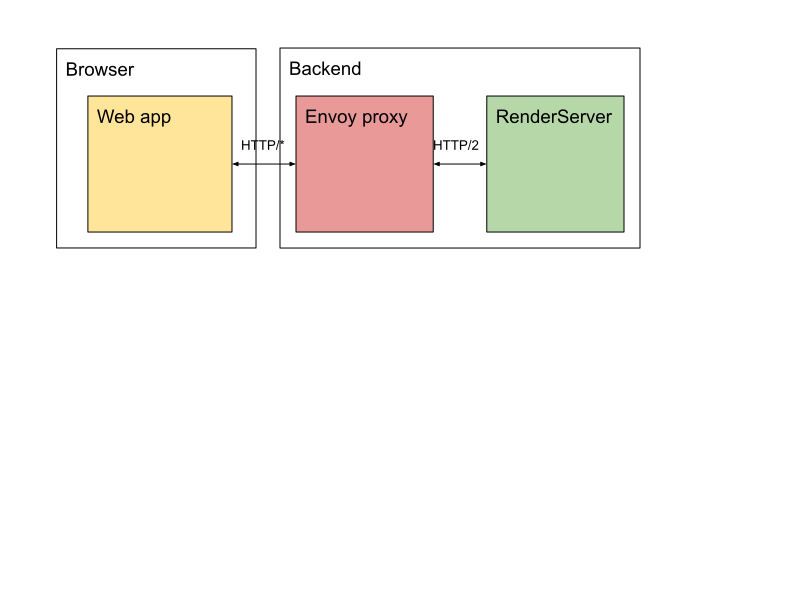
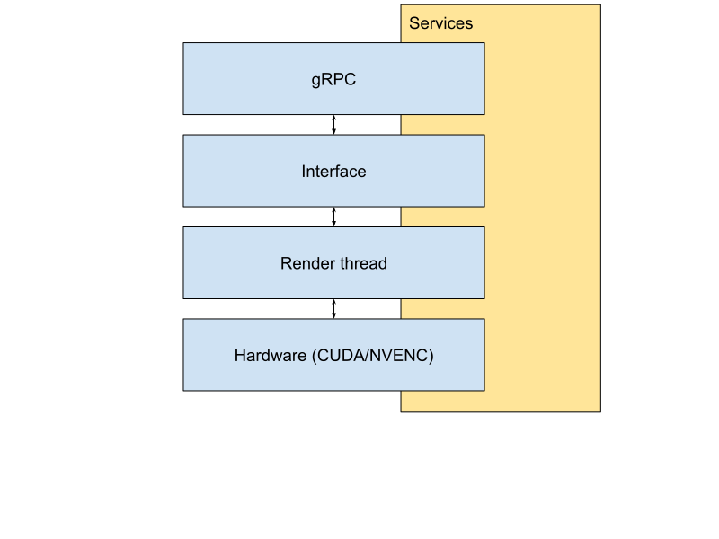

# Clara Viz Render Server Example

Sample implementation of a Render Server using a CUDA volume renderer to
visualize MHD/MHA files.
MHD/MHA is a file format used by ITK/VTK, see [ITK MetaIO](https://itk.org/Wiki/ITK/MetaIO)
for more information.

The example contains a docker compose definition which starts up all
needed containers.

There are three Docker containers

-   The Render Server
-   A web server
-   A proxy using Envoy translating between grpc-web and gRPC

See [gRPC-Web](https://github.com/grpc/grpc-web) for more information
on how to use gRPC from a browser client.

## Running

-   Install [NVIDIA Docker](https://github.com/NVIDIA/nvidia-docker)
-   Install [Docker Compose](https://docs.docker.com/compose/install)

First build the Docker containers. When building without any arguments
the Render Server container will use a generated MHD/MHA file:

```shell
docker compose build
```

To build the Render Server container to show a custom MHD volume file
place the MHD file and the corresponding RAW file into the datasets
directory and build the containers with:

```shell
docker compose build --build-arg VOLUME_FILE=datasets/my_volume.mhd
```

Then start the Docker containers:

```shell
docker compose up
```

Open Google Chrome or Firefox, navigate to `http:://localhost:8081`.

This will show a rendering of the MHD volume in four viewports. A
volumetric 3D rendering and three views of volume slices from the
X, Y and Z direction.

## Architecture

The web app (source file [ui/client.js](ui/client.js)) runs in the browser and uses
gRPC-web to communicate with the Render Server. Then Envoy proxy translates the
gRPC-web messages from the browser to gRPC messages on the backend.



### Render Server

The example Render Server uses the services provided by the Render Server SDK.



gRPC is the interface the clients use to communicate with the Render Server.
Three main interfaces are implemented. The video and camera interface is implemented
by classes in the SDK. The interface to set which slice is displayed is
implemented by the sample in [rpc/SliceRPC.cpp](rpc/SliceRPC.cpp).

The gRPC classes call into the interface classes below. The interface classes
do the parameter validation and send messages on new parameters to the render
thread. The sample implements the slice interface in
[interface/SliceInterface.cpp](interface/SliceInterface.cpp).

The main implementation file which is setting up and connecting the services is
[ExampleRenderServer.cpp](ExampleRenderServer.cpp). It sets up the gRPC server and
registers the camera and slice RPC calls to the server.
It creates the renderer and connects the interfaces to that renderer.
It also creates the video service which handles encoding of frames and sending them
to the web client. The video service also exchanges message with the render thread.

Finally the renderer is implemented in (cuda/Renderer.cu)[cuda/Renderer.cu]. It is
a message receiver getting messages from the interface and renders images using
CUDA. The rendered images are passed to the video service to be transported to
the client.
